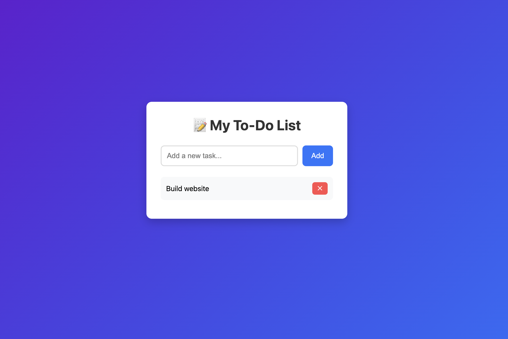

# To-Do List App

A simple, elegant to-do list application with local storage persistence.

## Features

- ✅ Add new tasks
- ✅ Mark tasks as completed
- ✅ Delete tasks
- ✅ Persistent storage using localStorage
- ✅ Beautiful gradient UI

## Snapshot



## How to Use

1. Clone or download this repository
2. Open `index.html` in your browser, or
3. Run a local server:
   ```bash
   python3 -m http.server 8000
   ```
4. Open `https://zed-todo-app.vercel.app/` in your browser

## Technologies Used

- HTML5
- CSS3
- Vanilla JavaScript
